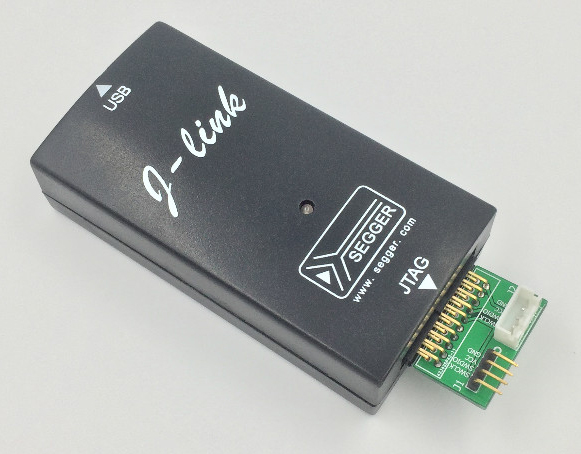
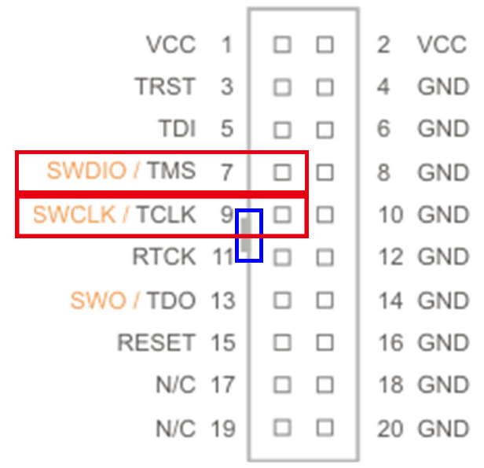
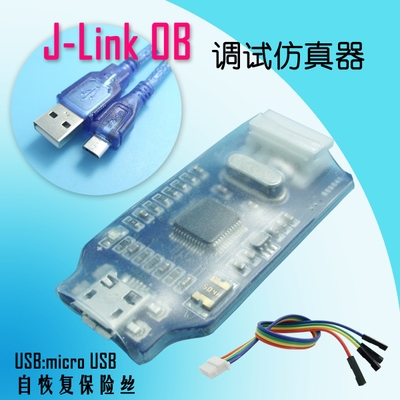
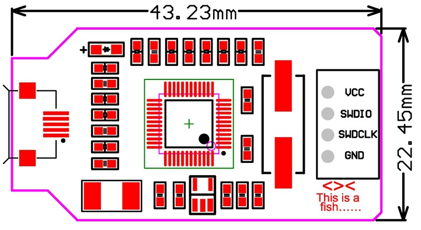
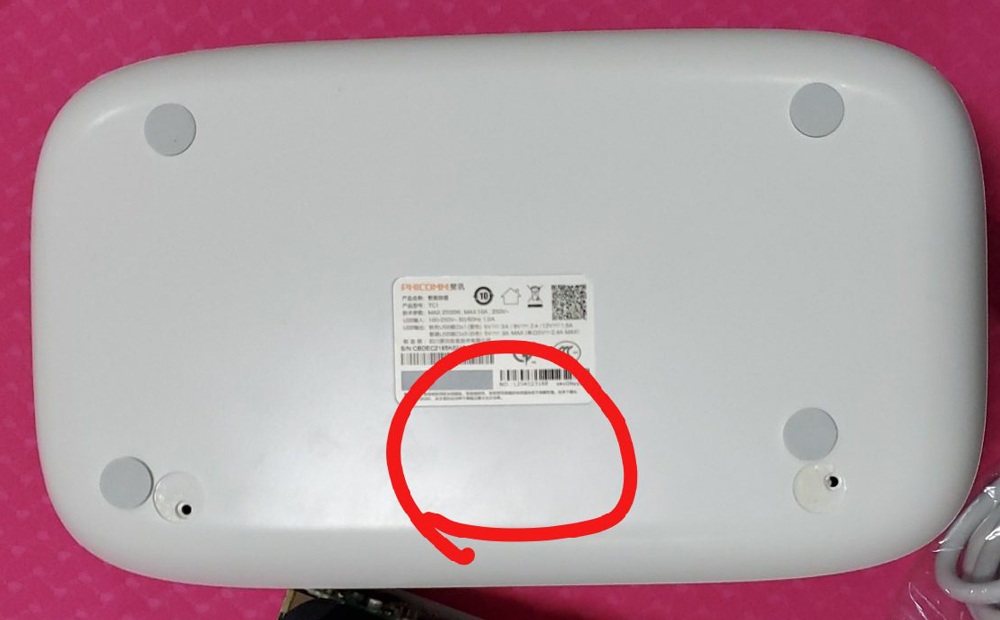
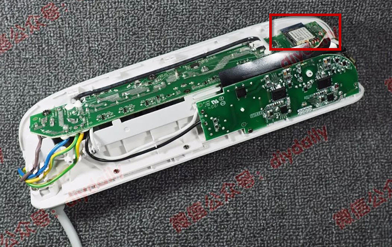
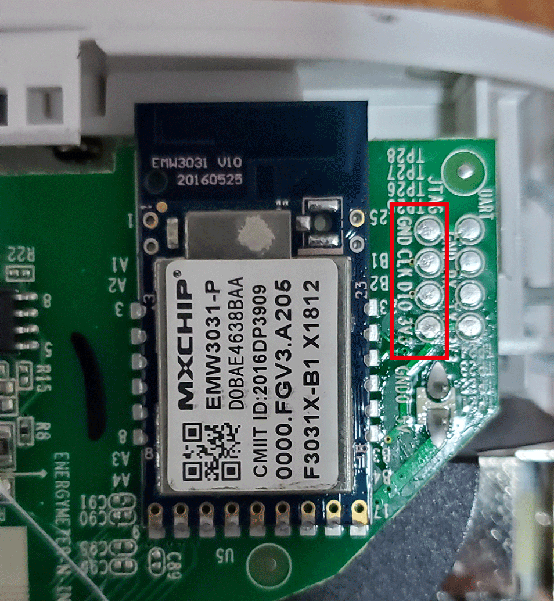
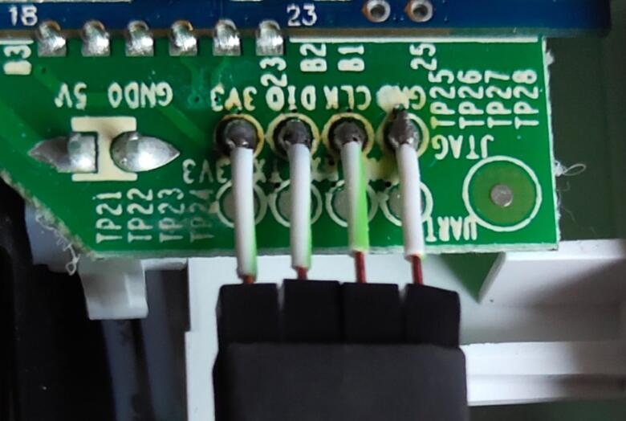
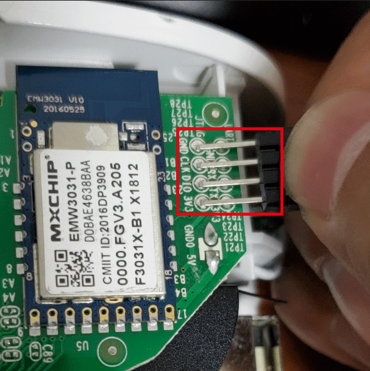
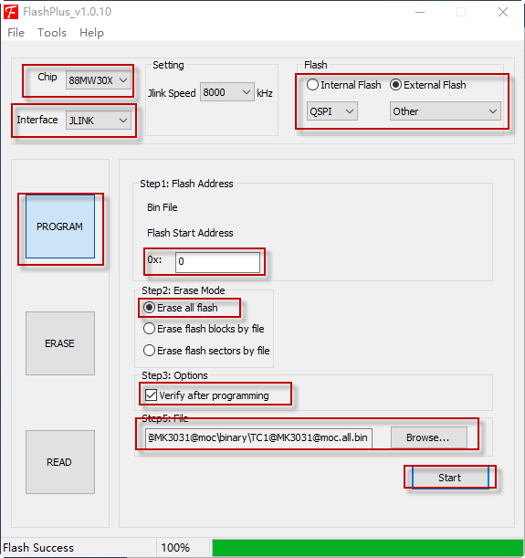

## 烧录前的准备

### 软件准备

烧录前,你需要下载好固件:见[Release](https://github.com/a2633063/zTC1/releases)，下载后文件应为bin格式.(烧录应该使用all.bin文件)

需要下载并安装软件FlashPlus [点这里下载](https://github.com/a2633063/zTC1/blob/master/README/FlashPlus_v1.0.10.msi.zip)

### 硬件准备

需要使用支持**swd的jlink烧录器**对TC1烧录固件.

可以直接在淘宝搜索swd.

注意:必须为jlink或兼容jlink. 写stlink的烧录器不支持. 结果网友测试便宜的价格大概为不到20元包邮.

(群内含有群友测试确认能用的烧录器链接.避免广告,这里不放链接).

下图为淘宝中常用的两种烧录器,左边为外观,右侧为引脚图.仅用**Vcc/swdio/swclk/gnd**

> 图片来自网络,侵删

#### TC1拆机

卸掉背面垫片下2颗螺丝(螺丝可能与常用螺丝不同,需要使用**t9梅花中空螺丝刀** ,这里就不贴图片了,自行淘宝).然后就可以想办法直接松卡扣取下即可.

如下图,拆开垫片下2颗螺丝后,倒放排插,重力捶击红圈位置,可无损将排插主体拆下.

拆开后的样子:(右上角红框内就是后面烧录FW需要处理的位置了)

> 文中部分图片来自微信公众号diydaily的拆机评测: https://mp.weixin.qq.com/s/8pxjWlDdObah92j2gPPImQ
>
> 已经获权使用.

如图,红圈内为我们需要用到的4个触点.分别为GND/3v3/clk/dio

将**gnd与jlink的gnd相连,dio与jlink的swdio相连,clk与jlink的swclk相连,3v3与jlink的vcc相连**,注意:你需要确认你使用的烧录器的电源为3.3V.

你可以使用**电烙铁焊接**:

或是用手直接将线**按在焊盘**上:(手抖接触不量导致烧录失败重试即可,不会损坏硬件).

强烈建议使用焊接而不是手按!

以上,就做好了烧录固件的硬件准备

> 烧录过程请不要接220V电!尽管烧录可以用220V电,但是为安全,请不要上220V电!!!!

## 烧录固件

打开安装好的FlashPlus 软件,对照截图,操作步骤如下:

1. 选择Chip :88MW30X
2. 选择Interface:JLINK
3. 选择Flash为External Flash,选择QSPI,选择Otehr
4. 单击PROGRAM按钮
5. Step1:Flash Address中地址输入0
6. Step2:Erase Mode中选择Erase all flash
7. Step3: Options中,建议勾选Verify after programming
8. 单击Browse,选择之前下载好的bin文件,注意选择all.bin结尾的文件,烧录应该使用**all.bin**文件.
9. 保证线连接正常.点击start开始下载,直到有成功的提示,则烧录完成

整个过程需要点选的按钮截图如下:

### 烧录完成

烧录完成后,重新上电.确认没有问题装回壳内即可使用.

你可以用以下方法来确认输入成功(一般情况下烧录弹出verify success的弹窗就已经烧录成功):

1. 普通上电,led会闪烁记下
2. 普通上电后,按住按键10秒,led会一直闪烁直到按键松开后,排插会自动重启(此为恢复默认设置)
3. 注意:刚刷完机由于还没有激活,所以上电后短按按键不会有任何动作!此为正常现象.

接下来就可以[**开始使用**](https://github.com/a2633063/zTC1/wiki/开始使用).

## ota在线升级

v0.2版本开始,开始支持ota在线升级.

> 注意:从之前版本更新到v0.2版本或第一次烧录必须使用烧录器进行手动烧录更新

~~ota需要一个web服务器,目前需要自己搭建web服务器,可以使用win自带的iis搭建一个可以访问的目录即可实现.~~ 目前直接使用码云服务器进行ota

在app端设备设置页面,点击当前版本后自动获取最新版本号,如果与当前版本不同会弹窗确认更新固件.

