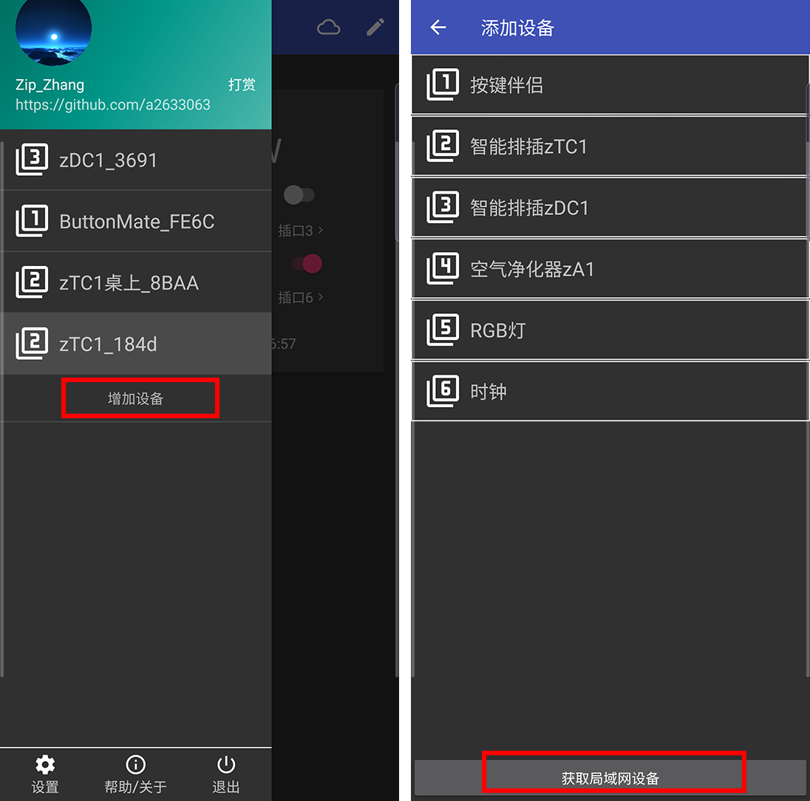
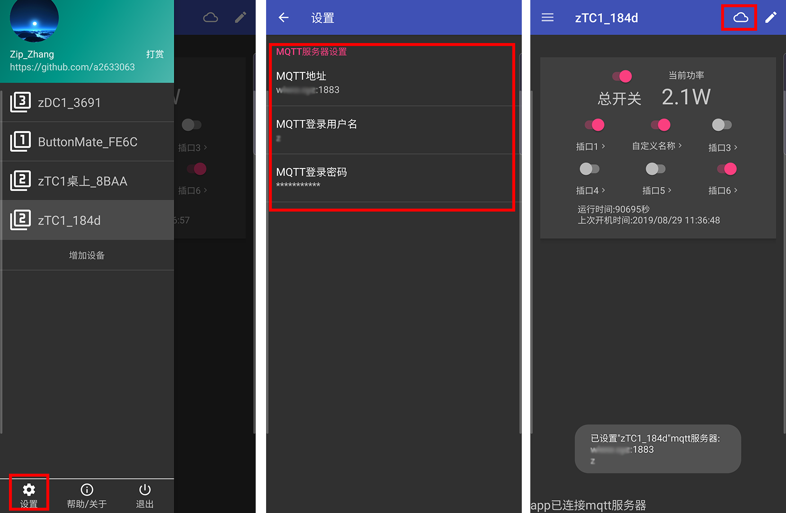
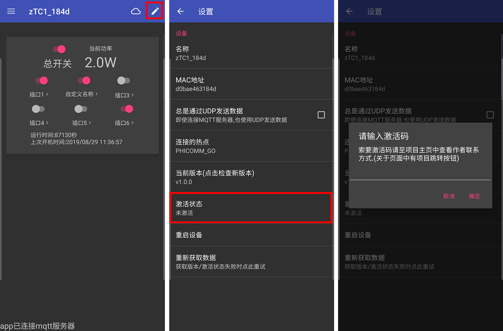
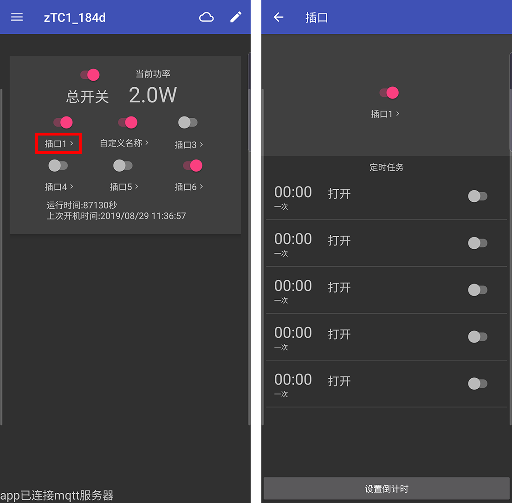

注意:以下截图非最新版本app截图.可能会略有不同.大体操作相似

此文档对应zTC1固件**v1.0.0及以上**版本.

## 初始化

烧录完成重新开机后,zTC1处于默认设置的状态.所有配置为默认配置.

后续需要恢复默认配置时,可以安住logo按键20s直到指示灯闪烁后松开按键,zTC1会自动重启并恢复默认配置.

## 配置

### 配网(连接wifi)

1. 排插第一次启动自动进入配网模式.手动进入方式为:将排插断电,等待约半分钟(需要将排插完全放电),按住按键不放,将排插上电,led慢闪即进入配网模式.
2. 配网模式状态为led慢闪(0.5秒亮灭切换).此时连接排插热点`zTC1_XXXX`(XXXX为MAC后四位),进入网页192.168.0.1.输入wifi名称(必须为2.4G)及密码点击下一步,提示配置成功.
3. 在路由器管理中确认排插连上wifi,zTC1在排插中名称为`zTC1_XXXX`(XXXX为MAC后四位).
4. 在APP中点击增加设备-获取局域网设备,app出现新的排插则连接wifi成功.可以进行下一步

>注意:
>
>1. 正常上电,led会快速闪烁2下,手动进入配网模式时,不会闪烁.
>2. 手动配置按住开关上电后,请在20秒内松开,否则会被识别为长按20秒的恢复默认设置.
>3. 配网后一直快速闪烁,表示正在连接wifi,熄灭表示连接成功,如果一直快速闪烁无法连接成功,请确认为2.4Gwifi,且步骤2中输入的wifi名称及密码正确.
>4. 如果点击获取局域网设备无效,请尝试多点击几次.
>5. 重新配网连接wifi不需要恢复默认设置

### MQTT配置

> 如果你没有MQTT服务器,甚至不知道MQTT是什么,可以忽略此项设置.
>
> 不连接MQTT服务器时,zTC1与手机通过udp通信.udp通信不稳定,可能需要多次操作才能生效,建议使用mqtt通信

> 如果你已经配置过mqtt服务器,再次配置时,需要**手动重启zTC1才能使新配置生效**

配置手机app中的mqtt服务器:

在侧边栏中点击设置按钮,输入MQTT地址,MQTT用户名,MQTT登录密码后返回设备界面.确保底部有提示服务器已经连接.

点击右上角云图标,app会通过udp将MQTT配置发给zTC1.如果正常,zTC1会直接连上MQTT服务器,现在就可以通过MQTT控制设备了.

> 注意:
>
> ​	MQTT地址格式为域名或IP:端口,如地址为www.xyz.com,端口为1883,则应该输入www.xyz.com:1883

## 激活

> 激活码获取见[自助获取激活码](https://github.com/a2633063/SmartControl_Android_MQTT/wiki/激活码获取)

**注意:如果未激活,排插6个插口无法开启,但其他功能如:连接wifi/获取版本号/连接mqtt服务器/OTA升级等功能不受影响,依然可以使用**

进入设备设置页面,APP会显示当前激活状态(如果不显示可能为网络不稳定未收到排插的数据,请重新进设备设置页面重试几次).

- 如果显示已激活,不需要再激活,
- 如果显示未激活,点击激活状态,输入获取到的激活码点击确认.
- 如果激活成功,则变为显示已激活,如果激活失败或通讯失败,不会有任何变化,请重新点击激活状态激活

## 使用

### 设备设置

点击右上角笔形图标,修改设备名称

点击开关图标,控制单个/全部插口通断电.

点击开关图标下的文字,进入单个插口设置页面.

插口页面下点击开关图标,控制此插口通断电.

插口页面下点击开关图标下的文字,设置单个插口此名称.

插口页面下点击定时任务,设置定时任务.

插口页面下点击设置倒计时,设置倒计时任务

> 注意:名称字符不能超过16个中文,同时,太长时可能会导致名称显示互相覆盖异常.

> 注意:每个插口能设置5组定时任务,倒计时任务将占用最后一组定时任务,且倒计时任务始终为一次重复.

## 接入home assistant

见[homeassistant接入](https://github.com/a2633063/zTC1/wiki/homeassistant接入)

## 固件OTA在线升级

见[ota在线升级](https://github.com/a2633063/zTC1/wiki/固件烧录#ota在线升级)